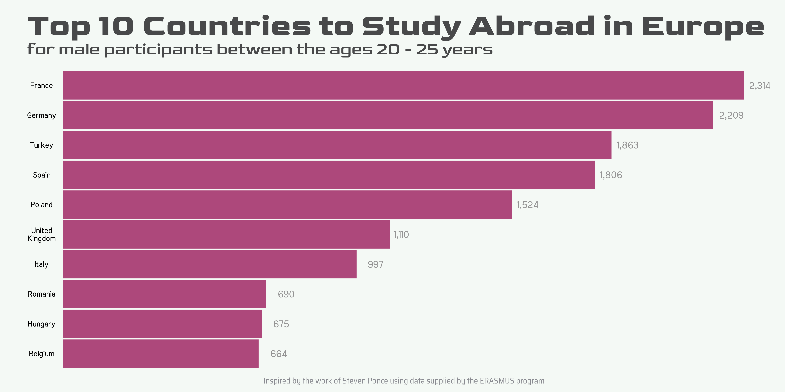

# Introduction

For this week's graduate training, I sourced data from the tidy tuesday github page, specifically the page relating to the week commencing 2022-03-08. The data for this week relates to EU student mobility. More context to the data provided for this week can be found
here: https://github.com/rfordatascience/tidytuesday/tree/master/data/2022/2022-03-08

Note, my work is heavily inspired from a tidy tuesday submission by Steven Ponce, found at the following link https://github.com/poncest/tidytuesday/blob/main/2022/Week_10/2022_10_erasmus.R . For this exercise, I aimed to produce a graph summarising the top 10 countries in which male 20-15 year olds studied abroad.

# My code

Below is the complete R file I created for this week's exercies


```{r, results='hide', message = FALSE, fig.show='hide'}
 # Graduate R training week 7 
# Note, this work is heavily inspired from a Tidy Tuesday submission submitted by
# Steven Ponce, found at https://github.com/poncest/tidytuesday/blob/main/2022/Week_10/2022_10_erasmus.R

#Load required packages 
library(tidytuesdayR)
library(tidyverse)
library(janitor)
library(showtext)
library(ggtext)
library(ragg)

#---- Load data ----

# Load data in from tidy tuesday github page as advised by the instructions found at
# https://github.com/rfordatascience/tidytuesday/tree/master/data/2022/2022-03-08

# One option is to use the tidytuesday package
#tues_data <- tidytuesdayR::tt_load('2022-03-08')
#erasmus <- tues_data$erasmus |> 
 # clean_names()

# Use manually method to load data
erasmus <- readr::read_csv('https://raw.githubusercontent.com/rfordatascience/tidytuesday/master/data/2022/2022-03-08/erasmus.csv')

#---- View the data ---- 

# Get the names of all variables in the data set 
names(erasmus)

# View all columns in data set and examples of their data values
glimpse(erasmus)

# View the entire table
View(erasmus)


#---- Wrangle the data ---- 

# I will aim to create a graph showing the top 10 receiving countries of male 
# participants aged between 20-25

# Create a table containing the necessary data for the above graph
male_receiving_countries_tbl <- erasmus |> 
  
  # Isolate the required gender, age and country columns
  select(participant_gender, participant_age, receiving_country_code) |> 
  
  # Apply appropriate gender and age filters
  filter(participant_gender == "Male", participant_age > 19, participant_age < 26) |> 
   
  # Count the number of males by country     
  group_by(receiving_country_code) |> 
  summarise(male_count = n()) |> 
    
  # Arrange table by descending male count value  
  arrange(desc(male_count)) |> 
  
  # Create new column with male_count nicely formatted
  mutate(formated_label = format(male_count, big.mark = ',')) |> 
    
  # Display the top 10 results  
  top_n(10) |> 
  
  # Replace country code with country name (case_when replicates the behavior of 
  # multiple if else statements)
  mutate(receiving_country_code = case_when(
    receiving_country_code == 'FR' ~ 'France',
    receiving_country_code == 'DE' ~ 'Germany',
    receiving_country_code == 'TR' ~ 'Turkey',
    receiving_country_code == 'ES' ~ 'Spain',
    receiving_country_code == 'PL' ~ 'Poland',
    receiving_country_code == 'UK' ~ 'United\nKingdom',
    receiving_country_code == 'IT' ~ 'Italy',
    receiving_country_code == 'RO' ~ 'Romania',
    receiving_country_code == 'HU' ~ 'Hungary',
    receiving_country_code == 'BE' ~ 'Belgium',
    
    # If this code was ever generalised, this would ensure the country code is used 
    # if the country is not listed above
    TRUE ~ receiving_country_code)) |> 
  
  # reorder in descending order
  mutate(receiving_country_code = receiving_country_code |> fct_reorder(male_count)) |>
    
  ungroup()

#---- Create Visualisation ----

## Add google fonts to the sysfonts package 
font_add_google(family='Goldman', 'Goldman')                              # will be used for the title
font_add_google(family='Meera Inimai', 'Meera Inimai')                    # will be used for the text
font_add_google(family='Saira Semi Condensed', 'Saira Semi Condensed') # will be used for the caption

# This will allow the showtext package to draw text (will allow
# the above fonts to be used)
showtext_auto(enable = TRUE) 

#Plot visuals
male_receiving_countries_tbl |> 
  
  #Set x and y axes
  ggplot(aes(x = male_count,
             y = receiving_country_code)) +
  
  # Set the colour, tranparency and width of the columns in the visual
  geom_col(fill = '#a12965', alpha = 0.85,
           width = 0.95) + 
  
  # Reduce distance between data and the axes
  scale_x_continuous(expand = c(.01, .01)) + 
  coord_cartesian(clip = 'off', expand = FALSE) +
  
  # Set y axis to show discrete values
  scale_y_discrete() +
  
  # Add labels summarising data of each bar 
  geom_text(aes(label = formated_label, hjust= -0.25), 
            family='Meera Inimai', 
            color = '#949494', size = 5) +
  
  # Add appropriate labels to plot
  labs(
    title = 'Top 10 Countries to Study Abroad in Europe',
    subtitle = "for male participants between the ages 20 - 25 years",
    caption = paste0("Inspired by the work of Steven Ponce using data supplied by the ERASMUS program")
  ) +
  
  
  # First, introduce an empty theme with a set font, from which we can customise the visual
  theme_void(base_family = "Meera Inimai") +  
  
  # Add custom aethetic changes 
  theme(
    # Align title and subtitle to entire plot
    plot.title.position = "plot",
    
    # Adjust colour of plot background 
    plot.background = element_rect(fill = "#f4f9f5", color = "#f4f9f5"),
    
    # Adjust colour of background of plotting area
    panel.background = element_rect(fill = "#f4f9f5", color = "#f4f9f5"),
    
    # Insert blank grid lines
    panel.grid = element_blank(),
    
    # Insert blank axis titles
    axis.title = element_blank(), 
    
    # Insert blank axis ticks
    axis.ticks = element_blank(), 
    
    # Adjust position of y axis data labels
    axis.text.y = element_text(margin = margin(r =10), hjust = 0.5),
    
    # Adjust margins around the plot
    plot.margin = margin(t = 5, r = 60, b = 5, l = 40),
    
    # Format plot title
    plot.title = element_text(
      family = 'Goldman',
      color = "#48494a",
      face = "bold",
      size = 45,  
      margin = margin(t = 20)),
    
    # Format plot subtitle
    plot.subtitle = element_text(
      family = 'Goldman',
      color = "#48494a",
      size = 25,  
      margin = margin(t = 5, b = 20)),
    
    # Format plot caption
    plot.caption = element_text(
      color = "#8a8b91",
      family = 'Saira Semi Condensed',
      size = 12,
      hjust = .5,
      margin = margin(t = 15, b = 5)))

# Adjust resolution
showtext_opts(dpi = 300)

# Save visual
ggsave("final_visual.png", plot = last_plot(),
       width = 16, height = 8, units = 'in',  dpi = 300)

# Turn off showtext_auto feature
showtext_auto(FALSE)
 
```

Please see the final plot produced by the code.



