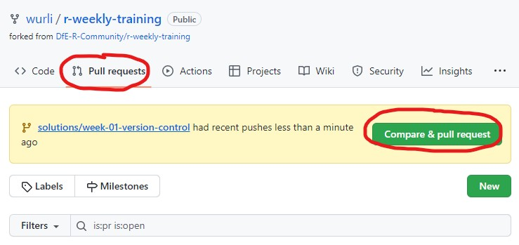

<!-- Please edit README.Rmd - not README.md -->

# Week 03: Version Control

> **Important**
>
> This section is written for users of GitHub. If you’re using Azure
> DevOps, please see
> [week-03b-version-control-azure-devops](week-03b-version-control-azure-devops)

This week we’ll introduce Git and GitHub for code version control. Using
version control for your code is helpful for lots of reasons, but the
main one is that it makes it easy to collaborate when writing code. This
training programme expects you to use Git and GitHub in future weeks to
get feedback on your solutions, so you should refer back to this
document if you forget how to do this.

# A Brief Overview

## What is Git?

Git is version control software originally designed to facilitate the
development of the Linux operating system. Using git, you can create
dedicated *repositories* for your projects. You can then track changes
to the project, and even create different versions (called ‘branches’)
of the repo to test specific ideas or features. If these work out, you
can ‘merge’ these branches back into the ‘main’ branch.

## What GitHub?

GitHub is a repository management service hosted by Microsoft. Using
Git, you can synchronise your projects with a central, online version
hosted on GitHub, which means that other people can also work
concurrently on the same code as you. Without Git, this sort of
collaboration is *really* difficult. GitHub has lots of other nice
features for managing development, perhaps the most useful being the
*pull request*.

## What is a Pull Request?

When you start a new strand of work on a Git-controlled project, you
will generally begin by ‘checking out a new branch’. Translation: you
will create a separate version of the project to work on without fear of
breaking things. When you’ve completed your new feature, a pull request
will be the mechanism by which you get your work ‘merged’ into the
‘main’ branch. This week’s exercises will guide you through the process,
beginning with installing Git and ending with creating your first pull
request.

# Exercises

To get started with Git, these exercises will guide you through the
process of cloning the training repo, adding your solutions for previous
weeks to a `solutions` folder, then making a pull request to merge these
into the main branch. In future, this will be how you’ll submit and
receive feedback on solutions, so don’t worry if this seems a lot to
take in. With Git, practice is the key, and the following steps should
cover 90% of what you’ll use it for day-to-day.

## Set-Up (One-Time Only)

### 00. Install Git

If you haven’t already, install Git. You can do this by internet
searching ‘Git for Windows’ or by going to [this
link](https://gitforwindows.org/). The only important thing to note when
installing git is **not to use the default text editor**. When asked to
choose a text editor, it is recommended that you choose Notepad - this
will make your life easier later on.

### 01. Fork `DfE-R-Community/r-weekly-training`

When you create a fork, you create a copy of a repository which is owned
by your GitHub account. Here you are free to make any changes you like,
and optionally to later request that these are merged back into the
original repo via a ‘pull request. To create a fork, use the ’Fork’
button at the top right of the screen

### 02. Clone Your Fork

The next task is to *clone* your forked version of the repo so you can
work on the code from your PC:

1.  Open RStudio and click ‘File \> New Project’. You should see an
    option for ‘Version Control’. Select this option, then select ‘Git’.
    You should now see a field ‘Repository URL’. To get this URL, go to
    your forked version of the repo on GitHub and copy the URL from your
    browser’s search bar.

    (Note: If this doesn’t work and you definitely have installed Git,
    try restarting RStudio. If this doesn’t work, try restarting your
    PC. If this *still* doesn’t work, try reinstalling Git and RStudio.
    If all else fails, get in touch :))

2.  You’ll also need to choose a sensible place for the project to live
    on your PC. A good option is to create a `Documents/Repos` folder
    and save it there. Wherever you save it, make sure OneDrive
    **doesn’t** have access to it - this can come back to bite you
    otherwise.

3.  Click ‘Create Project’ and Git will clone the repo

## Make and Submit a Change (Weekly)

### 03. Check the State of the Repo

Before you begin writing code, the first thing you should always do is
to check that your local copy of the repo is up to date with the version
hosted on GitHub. To do this, first run the following in the RStudio
Terminal (note, this is different to the Console):

    git fetch

Running `git fetch` tells Git to download any changes which have
happened in the repo since you last updated your local copy. Of course,
you just downloaded the repo, so right now this probably isn’t
necessary. However, you should get into the habit of doing this whenever
you open up a Git project so that your local version doesn’t fall behind
if other people make changes while you’re away.

Now run:

    git status

You should see a message which says something like
`nothing to commit,  working tree clean`. This means your current
version of the repo is just like the remote version. In other words,
you’re free to start making changes.

(Note, if you don’t see the Terminal, in RStudio, use Tools \> Terminal
\> New Terminal) to open a new instance. If you’d like to know what
Git’s actually doing here, run `git help checkout` in the terminal.

### 04. Check the Git Log

Now, look at the ‘git log’ to see where you are in the repo. You can
view the most recent, say, 10 commits to the repo as follows:

    git log --oneline --graph --all -10

This should produce an output similar to this:

    * f06a5b8 add PR template and a bit more content - Jacob Scott (origin/version-control, version-control)
    * 98f3cc7 a bit more stuff - Jacob Scott
    * bbfac6c add a load of new content about git - Jacob Scott
    * 1ff1cf9 update gitignore - Jacob Scott
    *   c8f22ee Merged PR 14895: Week 02 - Data Wrangling - Jacob SCOTT (HEAD -> main, origin/main, origin/HEAD)
    |\
    | * 5962a89 remove reference to filename - Jacob Scott (origin/content, content)
    | * a406f08 clarify wording - Jacob Scott
    | * a81c846 formatting and typos - Jacob Scott
    | * 9ce8a80 finalise week 2 content - Jacob Scott
    | * 1e67595 more stuff - Jacob Scott

Reading the git log takes practice. After running the command, study the
output and see if you can make sense of it. Some notes

- `HEAD` indicates your current position in the repo
- `origin/my-branch` indicates the current status of a branch on the
  *remote* repo - i.e. the version on GitHub
- Usually, next to a `origin/my-branch` you’ll also have `my-branch`.
  This indicates the status of your *local* version of the branch. These
  may not be in the same place though. If not, it will either be because
  you’re ahead of the remote version (fixed with `git push`) or the
  remote version is ahead of you (fixed with `git pull`).

### 05. Check Out a New Branch

With the repo now cloned, you should ‘check out’ a new branch where
you’ll add your solutions to previous and future problem sheets. To do
this, run the following in the RStudio Terminal. **Remember to replace
`jscott4` with your username!**

    git checkout -b solutions/week-01-version-control main

NB, conceptually, Git is like a history book for your project, and
creating a branch is like adding a new chapter. For this reason you
should strive to give your branches each a distinct scope, and you
should merge your branch back into the main branch when the planned
changes are complete.

### 06. Add a File

You can now start making changes in the repo. Create a new folder in the
repo, `solutions/your-username`. In this folder create a script called
`week-01-version-control.R` and add some code (`print("Hello world")` is
as good as anything). Once you’ve made this change, run:

    git status

This will give you a description of the state of your repo. You should
see something about ‘untracked files’. This means that, while Git can
see that you’ve made a change to the repo, Git doesn’t yet know what to
do with that change.

### 07. Commit Your Changes

We’ll now `git commit` the changes to the repo. In the RStudio terminal,
run

    git add .

This adds your changes to the ‘staging area’ - but they aren’t yet
committed. To commit them, run

    git commit -m "Add a 'Hello world\!' script"

Note that you need to escape the exclamation mark using `\!`. Note also
that your commit messages should be in the [*present tense* and
*imperative
mood*](https://stackoverflow.com/questions/3580013/should-i-use-past-or-present-tense-in-git-commit-messages).
This may feel weird at first, but this convention makes your commits
easier to read and work with in future.

NB, Git is more than happy for you to move your commits around and
squash them together as needed (Git lets you rewrite history when it’s
beneficial to do so). For this reason it’s best to make your commits
small and frequent, so you should repeat steps 6 and 7 quite often as
you keep changing code.

### 08. Push the Changes

You’ve now cloned the repo, checked out a new branch, made a change and
finally committed it. But all this has been done on your PC - the
remote, centralised version of the repo has no record of your changes.
To upload them, use `push`:

    git push

This will return an error, something like the following:

    fatal: The current branch soluions/week-01-version-control has no upstream branch.
    To push the current branch and set the remote as upstream, use

    git push --set-upstream origin solutions/week-01-version-control

Essentially this means that Git doesn’t know which branch in the remote
repo you’re trying to push your changes to. This is expected - your
branch doesn’t exist in the remote repo! To set up a branch to push to,
use the command suggested in the error message. The next time you run
`push`, everything should go through smoothly :)

### 10. Create a Pull Request

All that’s left now is to create a pull request to merge your solutions
into the original codebase. To do this, go to your forked version of the
repo on GitHub. At the top of the screen you should see a tab called
‘Pull Requests’

Creating a pull request you should make sure:

- The branch being merged *into* is `DfE-R-Community/r-weekly-training`

- The branch being merged *from* is
  `you/solutions/week-01-version-control`

- You have assigned someone to review your code (here wklimowicz is the
  assigned reviewer)

- You have written a concise, bulleted description of your changes

The final screen should look like this:

### 10. Complete the Pull Request

That’s it! Someone should now be able to look through your code and
leave a bit of feedback. You may want to go back into R and make some
more commits after this; if so, these will automatically be added to
your pull request (provided you don’t forget to `git push` them). Once
someone has reviewed your pull request they may ‘complete’ the it for
you, merging your changes into the main branch, or this may be deferred
until a convenient time, or they may ask you to complete it. Either way,
you should be notified via email once your branch is merged in.

# Summary of Git Commands

Well done! The steps you’ve now completed have covered 90% of everything
you’ll ever need to know about Git. Keep practising these by submitting
pull requests with your solutions each week and this process will become
second nature. To recap:

- Once you’ve forked and cloned a repo from GitHub, whenever you open it
  in RStudio, from the terminal use `git fetch` to update your local
  copy of the repo with information about the state of the remote
  version on GitHub

- After `git fetch`, run `git status` to see if your local version has
  fallen behind the main version on GitHub. If it has, you’ll be
  prompted to `git pull` any changes to update your local copy of the
  code. You should run `git fetch`, `git status` and `git pull` quite
  often, and should especially make a habit of doing it whenever you
  checkout the ‘main’ branch.

- Use `git checkout -b my-new-branch-name main` to create a new branch.
  Branch names should always use-this-format, i.e. hyphen-separated
  lower case.

- Whenever you feel you’ve made some tangible progress (which should be
  fairly frequently), use `git add my-changed-file` (or `git add .` to
  include all files) followed by
  `git commit -m "description of changes"` to *commit* your code to the
  repo.

- Periodically, you should `git push` to update the remote version with
  your new commits. The first time you `push` a new branch you’ll have
  to use something like `git push --set-upstream origin branch-name` to
  set up a remote branch where your changes will be pushed to. Git will
  remind you to do this :)

- If you want your changes merged into the original repo, find the repo
  on GitHub and create a pull request to merge your fork into the `main`
  branch of the original repo. Don’t forget to make sure all your
  changes are committed before doing this!

# Learning More

There are lots of other resources online to help learning Git:

- The [Git documentation](https://git-scm.com/book/en/v2) is
  comprehensive, but possibly difficult to dig into quickly.
  Nevertheless, it’s useful and you should get familiar with it.

- GitHub’s free [Introduction to
  GitHub](https://github.com/skills/introduction-to-github) is a good
  place to get familiar with the basics of GitHub, which are also
  outlined above

- The [GitHub Documentation](https://docs.github.com/en) is a handy
  reference to refer to for GitHub concepts such as forks, codespaces,
  pull requests etc

- If you prefer a video-based approach, the [Fireship video on how to
  use Git and GitHub](https://www.youtube.com/watch?v=HkdAHXoRtos) is a
  good primer on the topic
