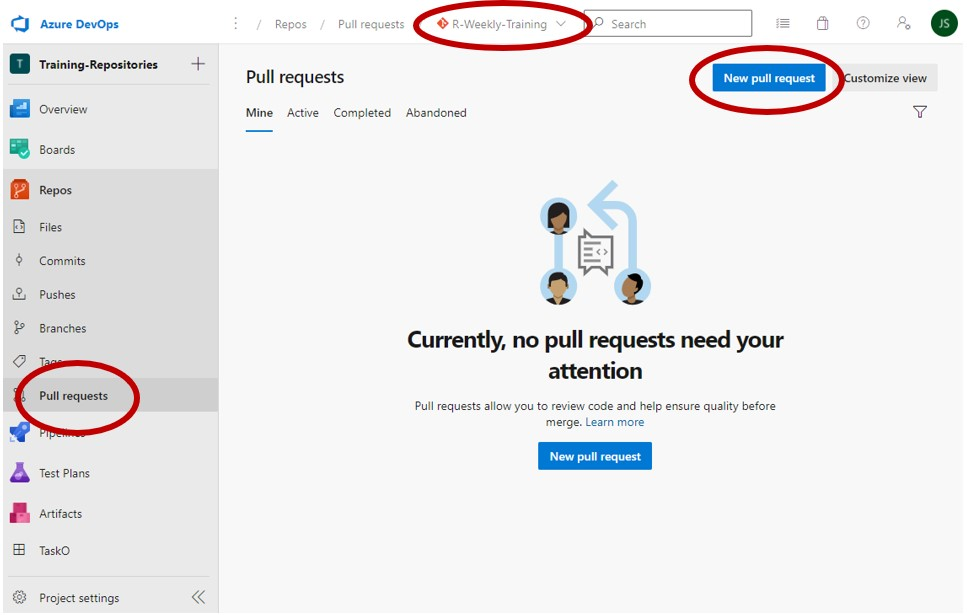

<!-- Please edit README.Rmd - not README.md -->

# Week 03: Version Control

This week we’ll introduce Git and Azure DevOps for code version control.
Using version control for your code is helpful for lots of reasons, but
the main one is that it makes it easy to collaborate when writing code.

# A Brief Overview

## What is Git?

Git is version control software originally designed to facilitate the
development of the Linux operating system. Using git, you can create
dedicated *repositories* for your projects. You can then track changes
to the project, and even create different versions (called ‘branches’)
of the repo to test specific ideas or features. If these work out, you
can ‘merge’ these branches back into the ‘main’ branch.

## What is Azure DevOps?

Azure DevOps is a repository management service hosted by Microsoft. You
may have heard of Github - Azure DevOps is similar, but is used by
corporations, generally for non-public work. Using Git, you can
synchronise your projects with a central, online version hosted on
DevOps, which means that other people can also work concurrently on the
same code as you. Without Git, this sort of collaboration is *really*
difficult. Azure DevOps has lots of other nice features for managing
development, perhaps the most useful being the *pull request*.

## What is a Pull Request?

When you start a new strand of work on a Git-controlled project, you
will generally begin by ‘checking out a new branch’. Translation: you
will create a separate version of the project to work on without fear of
breaking things. When you’ve completed your new feature, a pull request
will be the mechanism by which you get your work ‘merged’ into the
‘main’ branch. This week’s exercises will guide you through the process,
beginning with installing Git and ending with creating your first pull
request.


# Exercises

To get started with Git, these exercises will guide you through the
process of cloning the training repo, adding your solutions for previous
weeks to a `solutions` folder, then making a pull request to merge these
into the main branch. In future, this will be how you’ll submit and
receive feedback on solutions, so don’t worry if this seems a lot to
take in. With Git, practice is the key, and the following steps should
cover 90% of what you’ll use it for day-to-day.

1.  **Install Git**

    If you haven’t already, install Git. You can do this by internet
    searching ‘Git for Windows’ or by going to [this
    link](https://gitforwindows.org/). The only important thing to note
    when installing git is **not to use the default text editor**. When
    asked to choose a text editor, it is recommended that you choose
    Notepad - this will make your life easier later on.

2.  **Clone the Repo**

    The next task is to *clone* the training repository where these
    exercises are kept. Note: if you don’t have access, please contact
    [Jacob Scott](mailto:jacob.scott@education.gov.uk).

    1.  Open RStudio and click ‘File -&gt; New Project’. You should see
        an option for ‘Version Control’. Select this option, then select
        ‘Git’. You should now see a field ‘Repository URL’. You can get
        this from Azure Devops:

        (Note: If this doesn’t work and you definitely have installed
        Git, try restarting RStudioo. If this doesn’t work, try
        restarting your PC. If this *still* doesn’t work, try
        reinstalling Git and RStudio. If all else fails, get in touch
        :))

    2.  Go to the repository on [Azure
        Devops](https://dfe-gov-uk.visualstudio.com/Training-Repositories/_git/R-Weekly-Training).
        At the top-right you should see an option to ‘Clone’ the repo.
        Click this option and copy the URL provided. Enter this in the
        ‘Repository URL’ field.

    3.  You’ll also need to choose a sensible place for the project to
        live on your PC. A good option is to create a `Documents/Repos`
        folder and save it there. Wherever you save it, make sure
        OneDrive **doesn’t** have access to it - this can come back to
        bite you otherwise.

    4.  Click ‘Create Project’ and Git will attempt to clone the repo.
        There’s a possibility that this may fail due to incorrect proxy
        settings - if this happens you can fix this quite easily. In the
        terminal, enter

            git config --edit --global

        This will open your global `.gitconfig` file. In this file,
        delete any settings under `[http]`, `[https]` or
        `[credential "some.proxy.link"]`. After doing this, try cloning
        the repo again. You may be prompted to log in on Azure DevOps,
        but this will be a one-time occurrence - cloning future repos
        should ‘just work’. <!--  and replace -->
        <!--  with the following: -->

    <!--  ``` --> <!--  [http] -->
    <!--           proxy = http://username@mwg.proxy.ad.hq.dept:9090 -->
    <!--        sslVerify = false -->

    <!--  [https] -->
    <!--        proxy = https://username@mwg.proxy.ad.hq.dept:9090 -->

    <!--  [credential "http://mwg.proxy.ad.hq.dept:9090"] -->
    <!--        provider = generic --> <!--  ``` -->

    <!--  **Important note:** make sure you replace `username` in the above with -->
    <!--  your AD username - this will be the same one you use to log in to your -->
    <!--  work laptop. Now save the file and try cloning the repo again. The repo -->
    <!--  will now (hopefully) clone successfully :) -->

3.  **Check the State of the Repo**

    The next thing to do is ‘check out’ a new branch. First though, try
    running the following in the RStudio Terminal at the bottom of the
    screen

        git fetch

    Running this is essentially a way of telling Git to update its view
    of the version of the repo which is hosted on Azure DevOps. Of
    course - you just downloaded the repo, so this isn’t really
    necessary. However, you should get into the habit of doing this so
    your local version doesn’t fall behind if other people make changes
    while you’re away.

    Now run this:

        git status

    You should see a message which says something like
    `nothing to commit,  working tree clean`. This means your current
    version of the repo is just like the remote version. In other words,
    you’re free to start making changes.

    (Note, if you don’t see the Terminal, in RStudio, use Tools -&gt;
    Terminal -&gt; New Terminal) to open a new instance. If you’d like
    to know what Git’s actually doing here, run `git help checkout` in
    the terminal.

4.  **Look at the Git Log**

    Now, look at the ‘git log’ to see where you are in the repo. You can
    view the most recent, say, 10 commits to the repo as follows:

        git nl -10

    This should produce an output similar to this:

        * f06a5b8 - (2 minutes ago) add PR template and a bit more content - Jacob Scott (origin/version-control, version-control)
        * 98f3cc7 - (15 hours ago) a bit more stuff - Jacob Scott
        * bbfac6c - (16 hours ago) add a load of new content about git - Jacob Scott
        * 1ff1cf9 - (18 hours ago) update gitignore - Jacob Scott
        *   c8f22ee - (7 days ago) Merged PR 14895: Week 02 - Data Wrangling - Jacob SCOTT (HEAD -> main, origin/main, origin/HEAD)
        |\
        | * 5962a89 - (7 days ago) remove reference to filename - Jacob Scott (origin/content, content)
        | * a406f08 - (7 days ago) clarify wording - Jacob Scott
        | * a81c846 - (7 days ago) formatting and typos - Jacob Scott
        | * 9ce8a80 - (7 days ago) finalise week 2 content - Jacob Scott
        | * 1e67595 - (8 days ago) more stuff - Jacob Scott

    Reading the git log takes practice. After running the command, study
    the output and see if you can make sense of it. Some notes

    -   `HEAD` indicates your current position in the repo
    -   `origin/my-branch` indicates the current status of a branch on
        the *remote* repo - i.e. the version on Azure DevOps
    -   Usually, next to a `origin/my-branch` you’ll also have
        `my-branch`. This indicates the status of your *local* version
        of the branch. These may not be in the same place though. If
        not, it will either be because you’re ahead of the remote
        version (fixed with `git push`) or the remote version is ahead
        of you (fixed with `git pull`).

5.  **Check Out a New Branch**

    With the repo now cloned, you should ‘checkout’ a new branch where
    you’ll add your solutions to previous and future problem sheets. To
    do this, run the following in the RStudio Terminal. **Remember to
    replace `jscott4` with your username!**

        git checkout -b solutions/week-03-jscott4 main

    Note - the addition of `main` here isn’t strictly necessary, but
    this explicitly tells Git that your new branch should be based on
    the latest version of the `main` branch. If you base it off some
    other branch, `main` won’t be updated when your branch is finally
    merged in.

6.  **Change Some Files**

    You can now start making changes in the repo. Create a new folder in
    the repo, `solutions/your-username`. Copy your scripts for weeks 1
    and 2 into this folder. Now, in the RStudio terminal, run

        git status

    This will give you a description of the state of your repo. You
    should see something about ‘untracked files’. This means that, while
    you’ve made a change to the repo, you haven’t yet told Git what to
    do about it.

7.  **Commit the Changes**

    We’ll now `git commit` the changes to the repo. In the RStudio
    terminal, run

        git add .

    This adds your changes to the ‘staging area’ - but they aren’t yet
    committed. To commit them, run

        git commit -m "Add solution scripts for weeks 1 and 2"

    Note that your commit messages should be *present tense*. This may
    feel weird at first, but it makes them easier to understand in a
    development context.

8.  **Push the Changes**

    You’ve now cloned the repo, checked out a new branch, added some
    files and finally committed them. But all this has been done on your
    PC - the remote, centralised version of the repo has no record of
    your changes. To upload them, use `push`:

        git push

    This will return an error, something like the following:

        fatal: The current branch version-control has no upstream branch.
        To push the current branch and set the remote as upstream, use

        git push --set-upstream origin branch-name

    Essentially this means that Git doesn’t know which branch in the
    remote repo you’re trying to push your changes to. This is
    expected - your branch doesn’t exist in the remote repo! To set up a
    branch to push to, use the command suggested in the error message.
    The next time you run `push`, everything should go through smoothly
    :)

9.  **Create a Pull Request**

    Congratulations, the hard part is over! All that’s left now is to
    create a pull request to merge your solutions into the master
    branch. To do this, go to the
    [repo](https://dfe-gov-uk.visualstudio.com/Training-Repositories/_git/R-Weekly-Training)
    on Azure DevOps. On the left of the page should be a tab called
    ‘Pull Requests’

    

    Creating a new pull request, you should see a note giving some final
    checks you should make before submitting.

10. **Completing the Pull Request**

    That’s it! Someone should now be able to look through your code and
    leave a bit of feedback. You may want to go back into R and make
    some more commits after this; if so, these will automatically be
    added to your pull request (provided you don’t forget to `git push`
    them). Once someone has reviewed your pull request they may
    ‘complete’ the it for you, merging your changes into the main
    branch, or this may be deferred until a convenient time, or they may
    ask you to complete it. Either way, you should be notified via email
    once your branch is merged in.

# Summary of Git Commands

Well done! The steps you’ve now completed have covered 90% of everything
you’ll ever need to know about Git. Keep practising these by submitting
pull requests with your solutions each week and this process will become
second nature. To recap:

-   Use `git fetch` to update your local repo with information about the
    state of the remote version on Azure DevOps.

-   After `git fetch`, run `git status` to see if anything needs
    changing. After this, you may need `git pull` to actually update
    your local version of some particular branch if any changes have
    been made since you last worked on the project. You should do this
    quiet often - make a habit of doing it whenever you checkout the
    ‘main’ branch.

-   Use `git checkout -b branch-name main` to create a new branch.
    Branch names should always use-this-format, i.e. hyphen-separated
    lower case.

-   Whenever you feel you’ve made some tangible progress (which should
    be fairly frequently), use `git add .` followed by
    `git commit -m "description of changes"` to *commit* your code to
    the repo.

-   Periodically, you should `git push` to update the remote version
    with your new commits. The first time you `push` a new branch you’ll
    have to use something like
    `git push --set-upstream origin branch-name` to set up a remote
    branch where your changes will be pushed to. Git will remind you
    about this though.

-   If you want your changes merged into the main branch, make a pull
    request on Azure DevOps.

# Learning More

There are lots of other resources online to help learning Git. A good
resource produced by the ESFA is the Git chapter of [Using R in the
ESFA](https://rsconnect/rsc/esfa-r-training/git-building-intuition.html).
This goes into a lot more detail about these concepts - reading through
when you get the chance is highly recommended.
